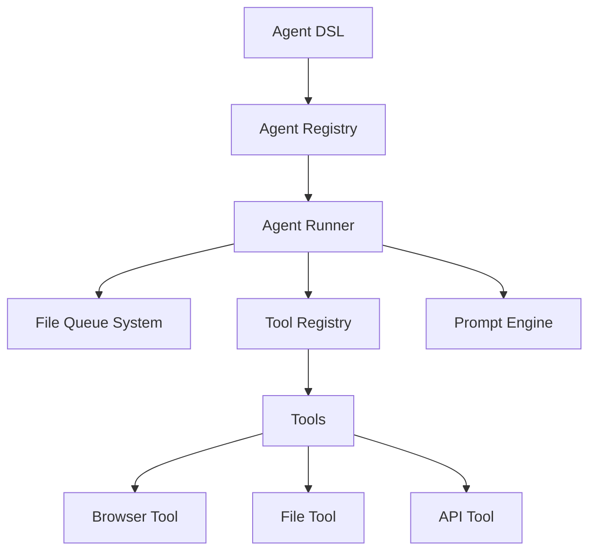

# AI Ruby Agent SDK - Architecture

## Overview

The AI Ruby Agent SDK is designed with simplicity and extensibility in mind, following Ruby's philosophy of providing a clean, elegant DSL while maintaining powerful capabilities underneath. The architecture follows a modular approach with clear separation of concerns.

## Core Components



### 1. Agent DSL Layer

The topmost layer providing a clean, Ruby-like interface for defining agents:

```ruby
module AgentDSL
  # Core DSL methods
  def agent(name, &block)
  def input(name, type: :string)
  def output(name, type: :string)
  def prompt(text = nil, &block)
  def tools(*names)
  def steps(&block)
  def loop(&block)
  def review(&block)
end
```

### 2. Agent Registry

Central registration system for managing agent definitions:

```ruby
module AgentRegistry
  def self.register(agent)
  def self.get(name)
  def self.all
end
```

### 3. File Queue System

Handles file-based communication between agents:

```ruby
module FileQueue
  class Directory
    attr_reader :path, :pattern
    
    def watch
    def enqueue(data)
    def dequeue
  end
end
```

### 4. Tool Registry

Unified interface for all external tools:

```ruby
module ToolRegistry
  def self.register(name, tool)
  def self.get(name)
  def self.available_tools
end
```

### 5. Prompt Engine

Handles template rendering and LLM interaction:

```ruby
class PromptEngine
  def initialize(template)
  def render(context)
  def send_to_llm(rendered_prompt)
end
```

## Data Flow

1. **Agent Definition**
   - Users define agents using the DSL
   - Agents are registered in the AgentRegistry
   - Tool dependencies are verified

2. **Execution Flow**
   ```mermaid
   sequenceDiagram
       participant User
       participant Agent
       participant FileQueue
       participant Tools
       participant LLM
       
       User->>Agent: Run agent
       Agent->>FileQueue: Read input
       Agent->>Tools: Initialize required tools
       Agent->>LLM: Send prompt
       LLM-->>Agent: Response
       Agent->>FileQueue: Write output
   ```

## Directory Structure

```
lib/
├── aira/
│   ├── agent.rb           # Core agent class
│   ├── dsl.rb            # DSL implementation
│   ├── registry.rb       # Agent registry
│   ├── file_queue/       # File-based queue system
│   ├── tools/            # Tool implementations
│   └── prompt/           # Prompt handling
```

## Key Abstractions

### Agent

The core unit representing a task executor:

```ruby
class Agent
  attr_reader :name, :description, :input, :output, :tools
  
  def run(context)
  def render_prompt(data)
  def execute_steps(context)
  def validate_output(result)
end
```

### Tool

Base interface for all tools:

```ruby
module Tool
  def self.included(base)
    base.extend(ClassMethods)
  end
  
  module ClassMethods
    def tool_name
    def tool_version
  end
  
  def execute(command, context)
end
```

## Security Considerations

1. **File System Safety**
   - Strict directory permissions
   - Sanitized file paths
   - Controlled access patterns

2. **Tool Isolation**
   - Sandboxed execution
   - Resource limits
   - Audit logging

## Extension Points

1. **Custom Tools**
   - Tool interface implementation
   - Registration system

2. **Queue Adapters**
   - Alternative queue implementations
   - Custom storage backends

3. **Prompt Templates**
   - Custom template engines
   - Prompt strategies

## Future Considerations

1. **Multi-Agent Coordination**
   - Agent communication protocols
   - Workflow orchestration
   - Resource sharing

2. **Performance Optimization**
   - Parallel execution
   - Caching strategies
   - Resource pooling

3. **Monitoring and Observability**
   - Metrics collection
   - Tracing
   - Health checks